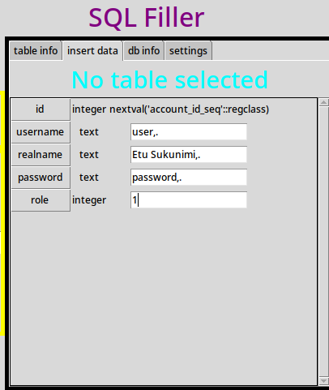

# Notes on inserttab

```python
sql_string = """SELECT 
        table_name, CAST(table_name::regclass AS oid) as table_id, column_name, ordinal_position, column_default, is_nullable, data_type, generation_expression, is_updatable, character_maximum_length 
        FROM information_schema.columns 
        WHERE table_schema=\'public\' AND table_name=%s
        ORDER BY ordinal_position ASC
        """
```
```text
source https://cloud.google.com/spanner/docs/information-schema-pg

useless_basic_columns_in_postgresql = 'table_catalog, table_schema, '
useful_basic_columns_in_postgresql = 'table_name, column_name, ordinal_position, column_default, is_nullable, data_type, generation_expression, is_updatable'
used_precision_columns_in_postgresql = 'character_maximum_length'

class_is_uniform_so_duplicate_info = 'numeric_precision, numeric_precision_radix, numeric_scale'
```


moving class scribble here:
```text
input:
(1, 15, 'user{anchor}', 'password{anchor}', 'helsinki')
(1, 15, {2: 'user{anchor}', 3: 'password{anchor}', 5:'helsinki'})

output:
insert.... user1, password1, helsinki
...
insert.... user15, password15, helsinki
```
    
```text
accept wildcards?
*?
??

what is anchor?
fields accept all sorts of symbols. need to find one that's used (see below) 

used rarely: less need to apply, applying needs to be simple and obvious af
used more often: better trained user, less need for obviousness, as long as it's easy to apply

,. ? i cant think of an everyday use for that combo. might have to change order or something, but here
we go. Let's start with this.
 
,{anchor} = ,,.
{anchor}. = ,..

I'll just re for that now, caveat emptor, here be dragons, all that. 
```
# TODO firstest add possibility to escape the sequence !

# TODO add some mockery of sanity to this.



