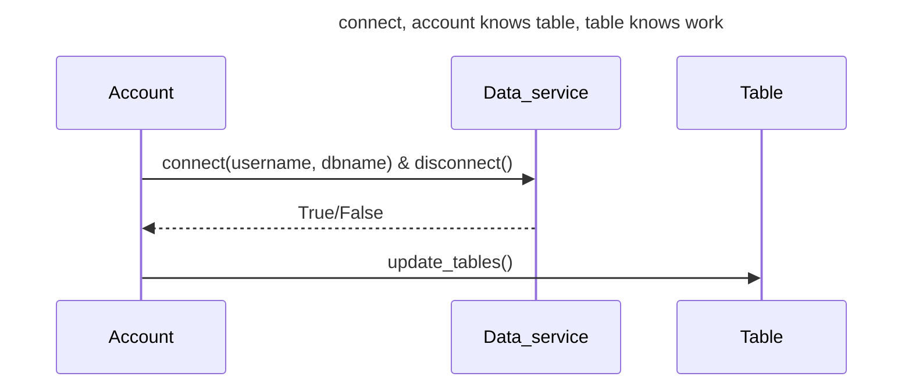
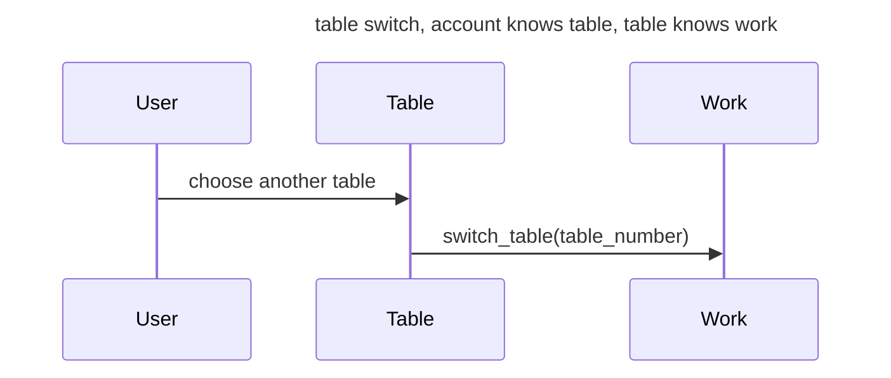
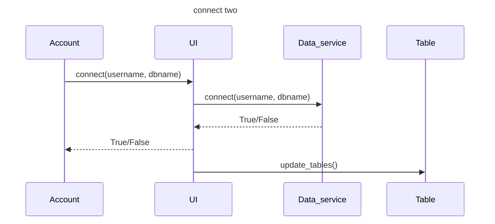

```mermaid
---
title: connect, account knows table, table knows work
---
sequenceDiagram
    Account->>Data_service: connect(username, dbname) & disconnect()
    Data_service-->>Account: True/False
    Account->>Table: update_tables()
```

```mermaid
---
title: table switch, account knows table, table knows work
---
sequenceDiagram
    User->>Table: choose another table
    Table->>Work: switch_table(table_number)
```

```mermaid
---
title: connect two
---
sequenceDiagram
    Account->>UI: connect(username, dbname)
    UI->>Data_service: connect(username, dbname)
    Data_service-->>UI: True/False
    UI -->>Account: True/False
    UI ->> Table: update_tables()
```